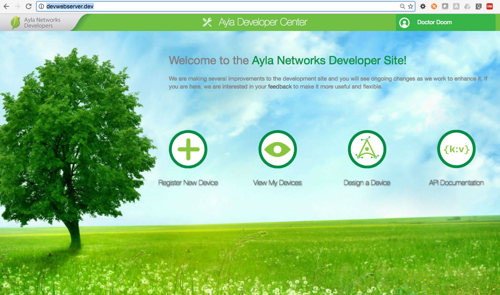
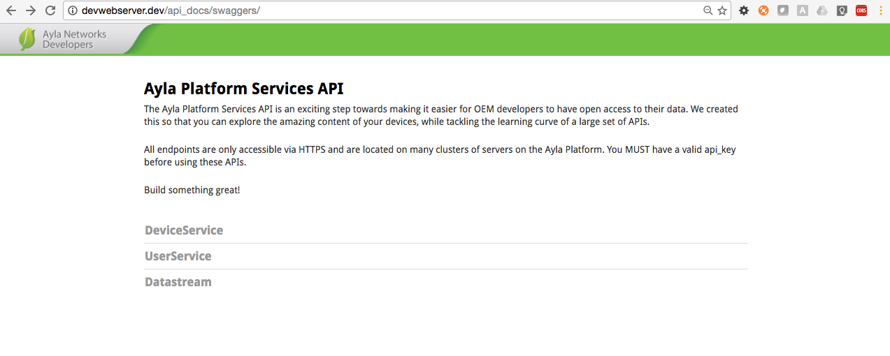
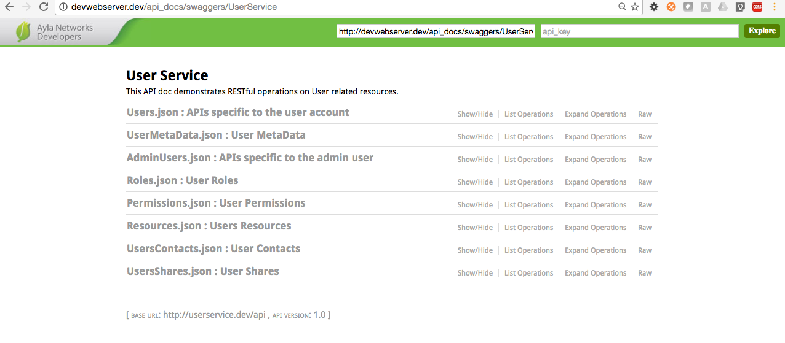
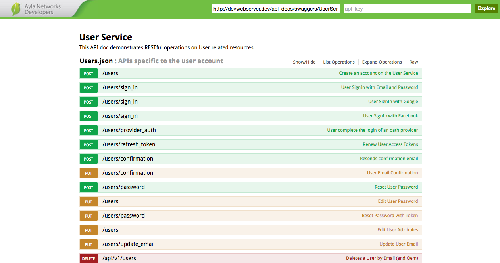
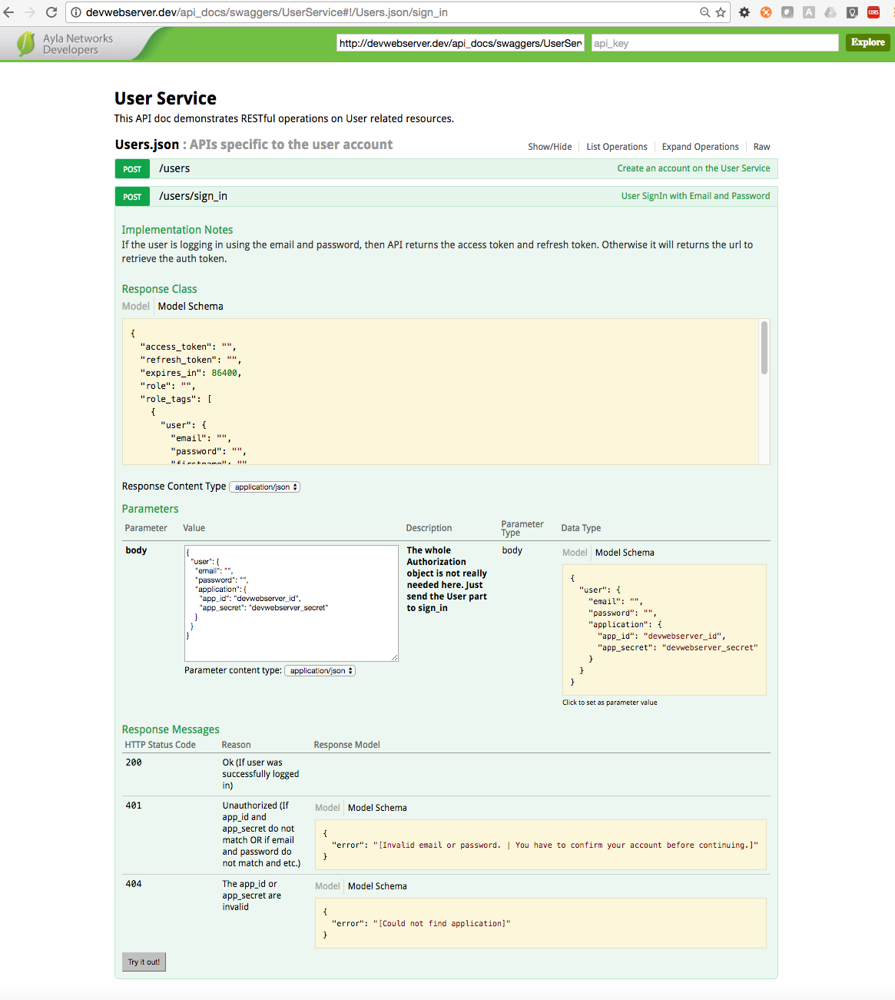

# Swagger Engine

Include [swagger-ui](https://github.com/swagger-api/swagger-ui) as rails engine.

This work is a heavily modified fork of [swagger-engine](https://github.com/batdevis/swagger_engine) 
 
The original project only supported swagger 2.0 , and I wanted to use swagger 1.2 so I re-wrote a bunch of stuff.


## Swagger specifications

https://github.com/swagger-api/swagger-spec/blob/master/versions/1.2.md

https://github.com/swagger-api/swagger-spec/blob/master/versions/2.0.md


## Installed in devwebserver

Add to Gemfile

```gem 'swagger_engine'```

Add to [config/routes.rb](https://github.com/AylaNetworks/devwebserver/blob/feature_swagger_ui/config/routes.rb#L45)

```mount SwaggerEngine::Engine, at: "/apibrowser"```

### Protect your route (Optional)

#### Devise

```
authenticate :user do
  mount SwaggerEngine::Engine, at: "/apibrowser"
end
```

or

```
authenticate :user, lambda { |u| u.admin? } do
  mount SwaggerEngine::Engine, at: "/apibrowser"
end
```

#### Basic http auth

Set username and password in `config/initializers/swagger_engine.rb`:

```
SwaggerEngine.configure do |config|
  config.admin_username = ENV['ADMIN_USERNAME']
  config.admin_password = ENV['ADMIN_PASSWORD']
end
```

## Configure

### Json files

Set the path of your json files in a [initializer of devwebserver](https://github.com/AylaNetworks/devwebserver/blob/feature_swagger_ui/config/initializers/swagger_engine.rb). 
Maybe something like this:

```
#config/initializers/swagger_engine.rb

SwaggerEngine.configure do |config|
  config.json_files = {
    v1: "lib/swagger/swagger_v1.json",
    v2: "lib/swagger/swagger_v2.json"
  }
end
```
`lib/swagger/` is a good place to place them (according to the original author). I did not put mine there.

### Edit your json files
Read about this [Swagger editor](https://github.com/swagger-api/swagger-editor) but dont use that.

Since this uses swagger 1.2 you will have more luck with this [Docker container](https://hub.docker.com/r/marcellodesales/swagger-editor/).

```
$ docker pull marcellodesales/swagger-editor:1.2-spec

$ docker images
marcellodesales/swagger-editor         1.2-spec            fe0226d46bc0        24 months ago       1.269 GB
```

## Screenshots

### DevWeb Home Page
This is a screen shot of devwebservice with this engine mounted at /apibrowser
 and the icon for API Documentation.



### SwaggerEngine : Main Page
This is a view of three microservice APIs. Each expands into a separate collection.
You can modify the message on this screen in [index.html.erb](https://github.com/AylaNetworks/devweb_swagger_engine/blob/master/app/views/swagger_engine/swaggers/index.html.erb)



### SwaggerEngine : Microservice API
This is a view of UserService APIs. Each expands into a collection of operations.
The microservice serves these from /public/swagger/YOURSERVICE/1.2/X.json
Edge service uses PathParam YOURSERVICE to help route the requests. 
There are currently two values:
- 'user' 
- 'device'




### SwaggerEngine : Microservice API
For instance the following came from [UserService :: User.json API Specification](https://github.com/AylaNetworks/userservice/blob/master/public/swagger/user/1.2/Users.json) .



### SwaggerEngine : User Signin with Email and Password

